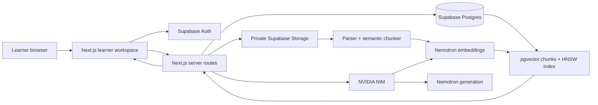
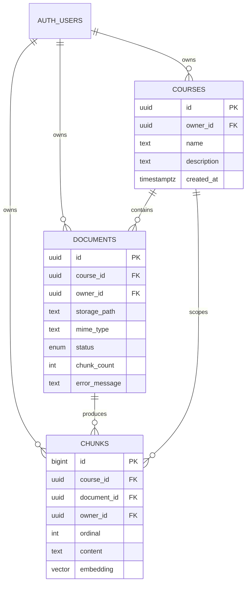
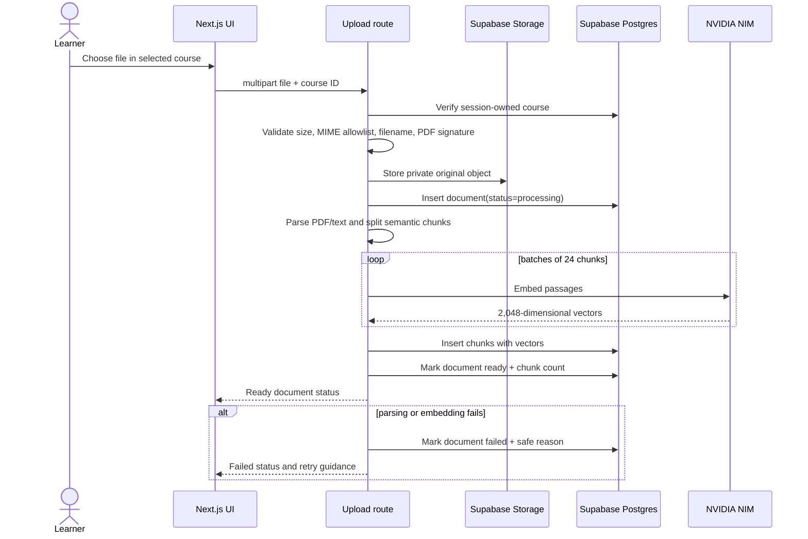
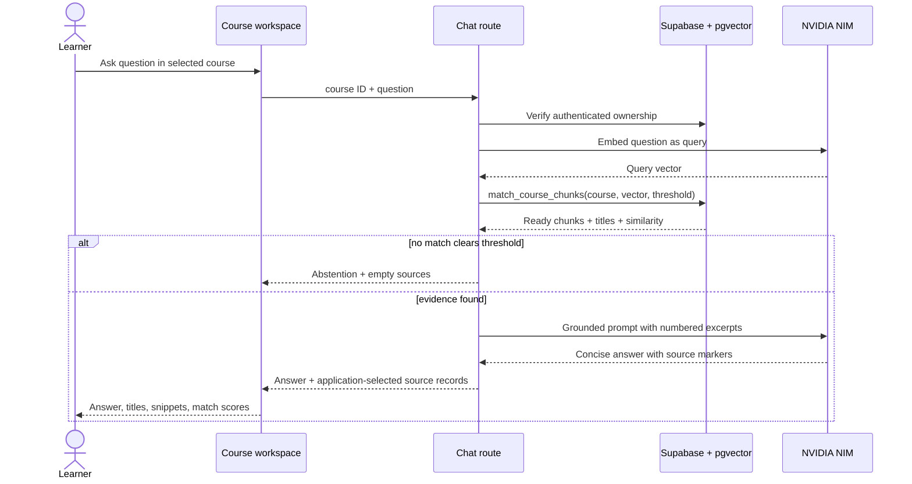

# CourseMate system design

CourseMate is a learner-owned study platform. A learner creates private courses from their own PDFs or notes, then asks questions and takes quizzes grounded only in the selected course. The system is designed to demonstrate production-minded full-stack, authorization, ingestion, and retrieval-augmented generation skills.

## Product journey

1. **Sign up or sign in.** Supabase Auth issues a session held in secure cookies and refreshed by the Next.js proxy.
2. **Create a course.** The learner provides a name and optional description. The new course is persisted with their Supabase user ID as owner.
3. **Upload material.** The learner uploads a PDF, Markdown, or text file up to 10 MB into the selected course.
4. **Watch ingestion status.** A document moves through `queued`/`processing` to `ready`, or to `failed` with an actionable message. Questions remain disabled until at least one document is ready.
5. **Ask the selected course.** The question is embedded and matched only against chunks whose `course_id` and `owner_id` belong to the current session.
6. **Inspect the evidence.** Answers display the original document title, a source snippet, and similarity score. When no passage meets the threshold, CourseMate abstains instead of guessing.
7. **Take a quiz.** CourseMate retrieves material from the selected course and generates three validated multiple-choice questions from that evidence.

## Architecture



### Component responsibilities

| Component | Responsibility |
| --- | --- |
| Next.js frontend | Authentication screens, empty course library, course creation/selection, upload and processing states, chat, sources, and quiz feedback. |
| Next.js route handlers | Validate requests, resolve the authenticated user, check course ownership, orchestrate Storage/database/NIM calls, normalize safe errors. |
| Supabase Auth | Email/password identity, session issuance, refresh, and logout. Passwords never pass through a custom credential store. |
| Supabase Postgres | Durable course, document, and chunk metadata with foreign keys, ownership constraints, and row-level security. |
| Supabase Storage | Private original document objects organized as `user/course/random-file`. Bucket policies prevent cross-user access. |
| pgvector | Stores 2,048-dimensional chunk embeddings; HNSW cosine index supports semantic retrieval. |
| NVIDIA NIM embeddings | Embeds document passages during ingestion and questions during retrieval with compatible input modes. |
| NVIDIA NIM generation | Produces concise answers with source markers and schema-constrained quizzes from retrieved evidence. |

## Data model



Ownership is intentionally repeated on documents and chunks. Composite foreign keys ensure those values cannot disagree with the parent document, while row-level security can authorize common reads without trusting a client-supplied join.

## Upload and ingestion sequence



The current route processes synchronously for a complete MVP. At larger scale, the upload route should return `202 Accepted` after persisting `queued`, and a durable worker should perform parsing and embeddings with retries and idempotency keys.

## RAG query and citation sequence



The model never chooses which database records appear as sources. The server selects records before generation and returns those same records to the UI, which prevents model-authored or fabricated source metadata.

## Security boundaries

- **Browser:** receives only the public Supabase URL and anon key. It never receives the service-role or NVIDIA API key.
- **Session boundary:** server routes call `auth.getUser()` rather than trusting local cookie contents. The proxy refreshes expiring sessions.
- **Authorization:** RLS uses `owner_id = auth.uid()`. Routes also resolve the course through the user-scoped client before every upload, retrieval, or quiz request.
- **Storage:** the bucket is private; object policies require the first path segment to equal the authenticated user ID.
- **Admin client:** the service-role client bypasses RLS only for ingestion writes after ownership was established. Every update still filters by document and owner ID.
- **Upload boundary:** MIME allowlist, 10 MB database/bucket/application limits, PDF magic-byte validation, randomized object names, and no user-controlled filesystem path.
- **Generation boundary:** questions and quiz topics are bounded by schema validation; prompts restrict generation to retrieved evidence; quiz JSON is parsed and validated before use.
- **Secrets:** all privileged values remain server-side environment variables. Never commit `.env.local` or log tokens, file contents, or raw credentials.

## Failure behavior

| Failure | User behavior | System behavior |
| --- | --- | --- |
| No courses | Course-creation empty state | No hidden demo content is inserted. |
| No ready documents | Chat and quiz disabled | Upload remains available and statuses stay visible. |
| Unsupported/oversized/disguised file | Clear validation message | File is rejected before parsing; invalid PDFs fail magic-byte validation. |
| Parsing or embedding failure | Document shows `failed` with safe reason | Database preserves failure state for diagnosis; no partial document becomes searchable. |
| Weak retrieval | Explicit “not enough evidence” answer | Generation is skipped and sources are empty. |
| NIM/database outage | Recoverable unavailable message | Error details are logged server-side without secrets; the app does not invent an answer. |
| Expired/invalid session | Redirect to sign-in | Supabase session refresh or reauthentication is required. |

## Deployment and configuration

No external project is created automatically. To deploy, the owner must:

1. Create or authorize a Supabase project.
2. Run `supabase/migrations/20260801140000_course_platform.sql` through the Supabase CLI or SQL editor.
3. Configure the Auth site URL and allowed redirect URLs for local and production domains.
4. Obtain an NVIDIA NIM API key with access to the configured chat and embedding models.
5. Set the following server/deployment values:

```text
NEXT_PUBLIC_SUPABASE_URL
NEXT_PUBLIC_SUPABASE_ANON_KEY
SUPABASE_SERVICE_ROLE_KEY
NVIDIA_API_KEY
NVIDIA_BASE_URL=https://integrate.api.nvidia.com/v1
NVIDIA_CHAT_MODEL=nvidia/nemotron-mini-4b-instruct
NVIDIA_EMBED_MODEL=nvidia/nemotron-3-embed-1b
```

The deployment runtime must support Next.js Node route handlers. Production should add a durable ingestion queue, malware scanning, rate limits, structured observability, deletion workflows, and a retention policy before accepting untrusted public traffic at scale.
